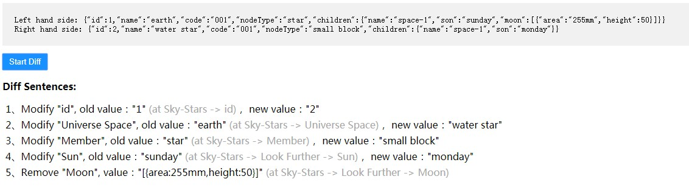

# humanized-object-diff

[](https://www.npmjs.com/package/humanized-object-diff)
[](LICENSE)

> Using Readable Sentences to describe differences between two Plain Objects, and providing self-defined templates to organize your own sentences.  
 **Notice:** `humanized-object-diff` is built on top of [human-object-diff](https://github.com/Spence-S/human-object-diff)

Try the [demo](https://dxmz.github.io/humanized-object-diff/) first, enjoy it.

<div align="center">
  
</div>


## Table of Contents

- [Install](#install)
- [Usage](#usage)
- [Configuring](#configuring)
  - [Options](#options)
  - [Custom Templates](#custom-templates)
  - [Support for Dates](#support-for-dates)
  - [Prefiltering](#prefiltering)
- [Contributors](#contributors)
- [License](#license)

## Install

[npm][]:

```bash
npm install humanized-object-diff
```

## Usage

> `humanized-object-diff` provides `esm`、`umd`、`cjs` versions, these bundles are list in `'/lib'`

```js
import DiffEngine from 'humanized-object-diff';

const lhs = { foo: 'bar' };
const rhs = { foo: 'baz' };
const options = {};

const diffEngine = new DiffEngine(options)

console.log(diffEngine.diff(lhs, rhs));
// -> ['Foo", with a value of "bar" (at Obj.foo) was changed to "baz"']
```

## Configuring

### Options

`humanized-object-diff` supports a variety of options to allow you to take control over the output of your object diff.

| Option       | type        | Default                            | Description                                                                                     |
| ------------ | ----------- | ---------------------------------- | ----------------------------------------------------------------------------------------------- |
| objectName   | String      | 'Obj'                              | This is the object name when presented in the path. ie... "Obj.foo" ignored if hidePath is true |
| prefilter    | Array\|Func |                                    | see [prefiltering](#prefiltering)                                                               |
| dateFormat   | String      | 'MM/dd/yyyy hh:mm a'               | dateFns format string see [below](#support-for-dates)                                           |
| ignoreArrays | Bool        | false                              | If array differences aren't needed. Set to true and skip processing                             |
| isFormatPath    | Bool     | false | If you want format diff-path to more readable path, set to true                                                              |
| formatTextStructure    | Object      | see [formatTextStructure](#custom-formatTextStructure) | Completely customize the output diff-path.                                                                |
| templates    | Object      | see [templates](#custom-templates) | Completely customize the output.  

### Custom FormatTextStructure  
`Usually we describe object fields such as form-value or data-object which using brief/meaningless words, but sometimes we want to describe modifies with readable/meaningful words. So 'FormatTextStructure' is suitable for you! See examples shown in blow.`

#### Example1
- Diff values as below:  
```js
const lhs = {
  id: 1, name: 'earth', code: '001', nodeType: 'star', children: {
    name: 'space-1', son: 'sunday', moon: [{ area: '255mm', height: 50 }]
  }
};
const rhs = {
  id: 2, name: 'water star', code: '001', nodeType: 'small block', children: {
    name: 'space-1', son: 'monday'
  }
};
```
- format Text Structure of the diff values  
```js
const formatTextStructure = {
  id: { formatTextName: 'id' },
  name: { formatTextName: 'Universe Space' },
  code: { formatTextName: 'NamingSpace' },
  nodeType: { formatTextName: 'Member' },
  children: {
    formatTextName: 'Look Further',
    name: { formatTextName: 'Our Moon' },
    son: { formatTextName: 'Sun' },
    moon: [{
      formatTextName: 'Moon',
      area: { formatTextName: 'Total Surface Area' },
      height: { formatTextName: 'Absolute Straight Height' }
    }]
  }
};
``` 

- output  
  - 1、Modify "id", old value："1" (at Sky-Stars -> id)， new value："2"
  - 2、Modify "Universe Space", old value："earth" (at Sky-Stars -> Universe Space)， new value："water star"
  - 3、Modify "Member", old value："star" (at Sky-Stars -> Member)， new value："small block"
  - 4、Modify "Sun", old value："sunday" (at Sky-Stars -> Look Further -> Sun)， new value："monday"
  - 5、Remove "Moon", value："[{area:255mm,height:50}]" (at Sky-Stars -> Look Further -> Moon)

#### Example2
- Diff values as below:  
```js
const lhs = [
  {
    'id': 1,
    'name': 'test-left-1',
    'nodeType': 'father',
    'childList': [{ 'id': 2, 'name': 'child-left1', 'nodeType': 'child' },
      { 'id': 3, 'name': 'child-left2', 'nodeType': 'child' },
      { 'id': 4, 'name': 'child-left3', 'nodeType': 'child' },
      { 'id': 5, 'name': 'child-left4', 'nodeType': 'child' }]
  },
  {
    'id': 6,
    'name': 'test-left-6',
    'nodeType': 'father',
    'childList': [{ 'id': 7, 'name': 'child-left7', 'nodeType': 'child' },
      { 'id': 8, 'name': 'child-left8', 'nodeType': 'child' },
      { 'id': 9, 'name': 'child-left9', 'nodeType': 'child' },
      { 'id': 10, 'name': 'child-left10', 'nodeType': 'child' }]
  }];

const rhs = [{
  'id': 1,
  'name': 'test-left-1',
  'nodeType': 'father',
  'childList': [{ 'id': 2, 'name': 'child-left1', 'nodeType': 'child' },
    { 'id': 4, 'name': 'child-left3', 'nodeType': 'child' },
    { 'id': 5, 'name': 'child-left4', 'nodeType': 'child' }]
},
  {
    'id': 11,
    'name': 'test-left-6',
    'nodeType': 'father',
    'childList': [{ 'id': 7, 'name': 'child-left7', 'nodeType': 'child' },
      { 'id': 8, 'name': 'child-right8', 'nodeType': 'child' },
      { 'id': 12, 'name': 'child-right12', 'nodeType': 'child' },
      { 'id': 10, 'name': 'child-left10', 'nodeType': 'child' }]
  }];
```
- format Text Structure of the diff values  
```js
const formatTextStructure = [
  {
    formatTextName: 'Readable Country Name',
    id: { formatTextName: 'Identify' },
    name: { formatTextName: 'City Style' },
    nodeType: { formatTextName: 'Happy Ending' },
    childList: [{
      formatTextName: 'Free Beers Palace',
      id: { formatTextName: 'Sub Identify' },
      name: { formatTextName: 'My House' },
      nodeType: { formatTextName: 'Sad Story' }
    }]
  }
];
``` 

- output  
  - 1、Modify "Identify", old value："6" (at Sky-Stars -> Readable Country Name -> Identify)， new value："11"
  - 2、Modify "Sub Identify", old value："9" (at Sky-Stars -> Readable Country Name -> Free Beers Palace -> Sub Identify)， new value："12"
  - 3、Modify "My House", old value："child-left9" (at Sky-Stars -> Readable Country Name -> Free Beers Palace -> My House)， new value："child-right12"
  - 4、Modify "My House", old value："child-left8" (at Sky-Stars -> Readable Country Name -> Free Beers Palace -> My House)， new value："child-right8"
  - 5、Modify "Sub Identify", old value："4" (at Sky-Stars -> Readable Country Name -> Free Beers Palace -> Sub Identify)， new value："5"
  - 6、Modify "My House", old value："child-left3" (at Sky-Stars -> Readable Country Name -> Free Beers Palace -> My House)， new value："child-left4"
  - 7、Modify "Sub Identify", old value："3" (at Sky-Stars -> Readable Country Name -> Free Beers Palace -> Sub Identify)， new value："4"
  - 8、Modify "My House", old value："child-left2" (at Sky-Stars -> Readable Country Name -> Free Beers Palace -> My House)， new value："child-left3"
  - 9、Array "Free Beers Palace" (at Sky-Stars -> Readable Country Name -> Free Beers Palace), removed "{id:3,name:child-left2,nodeType:child} at index【1】"

### Custom Templates

`humanized-object-dff` let's you fully customize your sentences by allowing you to pass custom sentence templates. 

`humanized-object-dff` adds templating languages engine, which could avoid some bugs in replacing placerholders.

The default template looks like the following:

```js
const templates = {
  dateFormat: 'MM/dd/yyyy hh:mm a',
  objectName: 'Obj',
  ignoreArrays: false,
  sensitivePaths: [],
  dontHumanizePropertyNames: false,
  templates: {
    N: '"{{FIELD}}", with a value of "{{NEW_VALUE}}" (at {{DOT_PATH}}) was added',
    D: '"{{FIELD}}", with a value of "{{OLD_VALUE}}" (at {{DOT_PATH}}) was removed',
    E:
      '"{{FIELD}}", with a value of "{{OLD_VALUE}}" (at {{DOT_PATH}}) was changed to "{{NEW_VALUE}}"',
    I:
      'Array "{{FIELD}}" (at {{DOT_PATH}}), had a value of "{{NEW_VALUE}}" inserted at index {{INDEX}}',
    R:
      'Array "{{FIELD}}" (at {{DOT_PATH}}), had a value of "{{OLD_VALUE}}" removed at index {{INDEX}}',
    AE:
      'Array "{{FIELD}}" (at {{DOT_PATH}}), had a value of "{{OLD_VALUE}}" changed to "{{NEW_VALUE}}" at index {{INDEX}}',
    NS: '"{{FIELD}}" (at {{DOT_PATH}}) was added',
    DS: '"{{FIELD}}" (at {{DOT_PATH}}) was removed',
    ES: '"{{FIELD}}" (at {{DOT_PATH}}) was changed',
    IS: 'Array "{{FIELD}}" (at {{DOT_PATH}}), had a value inserted at index {{INDEX}}',
    RS: 'Array "{{FIELD}}" (at {{DOT_PATH}}), had a value removed at index {{INDEX}}',
    AES: 'Array "{{FIELD}}" (at {{DOT_PATH}}), had a value changed at index {{INDEX}}'
  }
};
```

Where N is a new key, D is a deleted key, E is an edited key, I is an inserted array value, R is a removed array value, and AE is an edited array property.

We also expose a sensitiveFields array option which will cause a path to use the S option template.

You can define each sentence in templates to be whatever you'd like them to be and you can use the following codes that will be replaced by their diff values in the final output.

The available values you can plug in to your sentences are `FIELD`, `FORMAT_FIELD`, `DOT_PATH`, `DOT_TEXT`,`NEW_VALUE`,`OLD_VALUE`, `INDEX`, `POSITION`. Position is just index+1. Be aware that not all sentence types will have values for each token. For instance non array changes will not have a position or an index.
**Notice:**
- `FORMAT_FIELD` and `DOT_TEXT` are used for formating diff path, of course you could use all available values in your own way.  
- templates could use html pattern to prettify diff sentences:
   ```js
   const templates = {
  N: 'Add "{{FORMAT_FIELD}}", new value："{{NEW_VALUE}}" <span style="color: darkgray"><span style="color: darkgray">(at {{{DOT_TEXT}}})<span/><span/>'};
   ```

### Support for Dates

`humanized-object-diff` uses `date-fns` format function under the hood to show human readable date differences. We also supply a `dateFormat` option where you can supply your own date formatting string. Please note, that date-fns format strings are different from moment.js format strings. Please refer to the documentation [here](https://date-fns.org/v2.8.1/docs/format) and [here](https://github.com/date-fns/date-fns/blob/master/docs/unicodeTokens.md)

### Prefiltering

There may be some paths in your object diffs that you'd like to ignore. You can do that with prefiltering. As a convenience, ou can add this option as an array of strings, which are the keys of the base path of the object.

for instance

```js
const lhs = { foo: 'bar', biz: { foo: 'baz' } };
const rhs = { foo: 'bar', biz: { foo: 'buzz' } };

hrDiff(lhs, rhs, { prefilter: ['foo'] });
```

You would still see the diffs for `biz.foo` but you would ignore the diff for `foo`.

You can also pass a function for this option which will be directly passed to the [underlying diff library](https://www.npmjs.com/package/deep-diff).

The prefilter function takes a signature of `function(path, key)`. Here path is an array that represents the path leading up to the object property. The key is the key, or what would be the final element of the path. The function returns true for any paths you would want to ignore.

For instance, in the object below:

```js
const obj = { foo: { bar: [1, 2, { baz: 'buzz' }] } };
```

The path and key for `foo` would be path \[] and key 'foo'.

The path and key for `foo.bar` would be path \['foo'] key 'bar'

for `foo.bar[2].baz` it would be path: \['foo', 'bar', 2] and key 'baz'

To ignore changes in `foo.bar` you could pass a functions like

```js
const prefilter = (path, key) => path[0] === 'foo' && key === 'bar';
```

## A Note On Arrays

`humanized-object-diff` parses arrays in an opinionated way. It does it's best to resolve Arrays into groups of insertions and removals. Typical diff libraries look at arrays on an element by element basis and emit a difference for every changes element. While this is benefical for many programatic tasks, humans typically don't look at arrays in the same way. `humanized-object-diff` attempts to reduce array changes to a number of insertions, removals, and edits. An example can better describe the difference.

```js
const lhs = [1, 2, 3, 4];
const rhs = [0, 1, 2, 3, 4];
```

Consider the above arrays and their differences. A typical array diff would behave like this and output something like the following.

1. A change at index 0 from 1 to 0
2. A change at index 1 from 2 to 1
3. A change at index 2 from 3 to 2
4. A change at index 3 from 4 to 3
5. An addition of 4 at index 4

`humanized-object-diff` attempts to reduce these differences to something like the following.

1. An insertion of 0 at index 0. ("Array 'lhs' had a value of 0 inserted at index 0")

This is much more understandable to a human brain. We've simply inserted a number at an index.

## Contributors

| Name               | Website                    |
| ------------------ | -------------------------- |
| **Spencer Snyder** | <http://spencersnyder.io/> |

## License

[MIT](LICENSE) © [Spencer Snyder](http://spencersnyder.io/)

##

[npm]: https://www.npmjs.com/
[yarn]: https://yarnpkg.com/
